Lesson 3
========================================================
### Pseudo-Facebook User Data

```r
getwd()
```

```
## [1] "D:/Study/On Going/EDA with R/Module3"
```

```r
pf <- read.csv('pseudo_facebook.tsv', sep = "\t")
pf <- read.delim('pseudo_facebook.tsv')
?read.csv
```

```
## starting httpd help server ... done
```

```r
?read.delim
names(pf)
```

```
##  [1] "userid"                "age"                  
##  [3] "dob_day"               "dob_year"             
##  [5] "dob_month"             "gender"               
##  [7] "tenure"                "friend_count"         
##  [9] "friendships_initiated" "likes"                
## [11] "likes_received"        "mobile_likes"         
## [13] "mobile_likes_received" "www_likes"            
## [15] "www_likes_received"
```

### Histogram of Users' Birthdays
Notes:


```r
install.packages('ggplot2')
```

```
## Error in contrib.url(repos, "source"): trying to use CRAN without setting a mirror
```

```r
library(ggplot2)
qplot(x = dob_day, data = pf)
```

```
## stat_bin: binwidth defaulted to range/30. Use 'binwidth = x' to adjust this.
```

 

```r
qplot(x = dob_day, data = pf)+
  scale_x_discrete(breaks = 1:31)
```

 

***

Run the following code in R to get other themes. 

```r
install.packages('ggthemes', dependencies = TRUE) 
```

```
## Error in contrib.url(repos, "source"): trying to use CRAN without setting a mirror
```

```r
library(ggthemes) 
theme_set(theme_minimal(24)) 
```

Plot using ggplot 

```r
ggplot(aes(x = dob_day), data = pf) + 
  geom_histogram() + 
  scale_x_discrete(breaks = 1:31)
```

 


#### What are some things that you notice about this histogram?

Response: huge number of people have birthday the first day of months 

### Faceting
histogram for each month


```r
qplot(x = dob_day, data = pf)+
  scale_x_discrete(breaks = 1:31)+
  facet_wrap(~dob_month, ncol = 4)
```

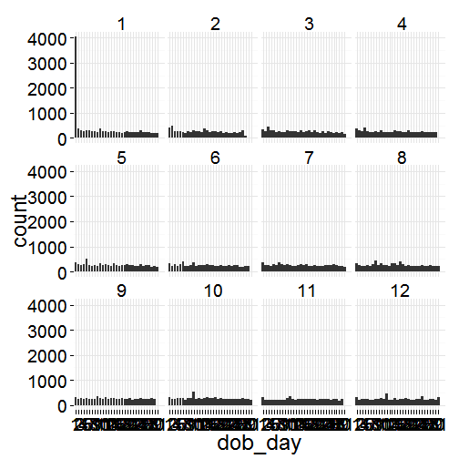 

equalent but hard to look at using facet_grid

```r
qplot(x = dob_day, data = pf)+
  scale_x_discrete(breaks = 1:31)+
  facet_grid(. ~ dob_month)
```

 


ggplot equalient

```r
ggplot(data = pf, aes(x = dob_day)) + 
  geom_histogram() + 
  scale_x_discrete(breaks = 1:31) + 
  facet_wrap(~dob_month)
```

 

#### Let us take another look at our plot. What stands out to you here?
Response: January 1st
  
### Friend Count

#### What code would you enter to create a histogram of friend counts?


```r
qplot(x = friend_count, data = pf)
```

```
## stat_bin: binwidth defaulted to range/30. Use 'binwidth = x' to adjust this.
```

 

#### How is this plot similar to Moira's first plot?
Response: long tail

### Limiting the Axes

```r
qplot(x = friend_count, data = pf, xlim = c(0,1000))
```

```
## stat_bin: binwidth defaulted to range/30. Use 'binwidth = x' to adjust this.
```

 


```r
qplot(x = friend_count, data = pf)+
  scale_x_continuous(limits = c(0,1000))
```

```
## stat_bin: binwidth defaulted to range/30. Use 'binwidth = x' to adjust this.
```

 

### Adjusting the Bin Width

### Faceting Friend Count

```r
# What code would you add to create a facet the histogram by gender?
# Add it to the code below.
qplot(x = friend_count, data = pf, binwidth = 10) +
  scale_x_continuous(limits = c(0, 1000),
                     breaks = seq(0, 1000, 50))
```

 


```r
qplot(x = friend_count, data = pf, binwidth = 10) +
  scale_x_continuous(limits = c(0, 1000),
                     breaks = seq(0, 1000, 50))+
  facet_wrap(~gender)
```

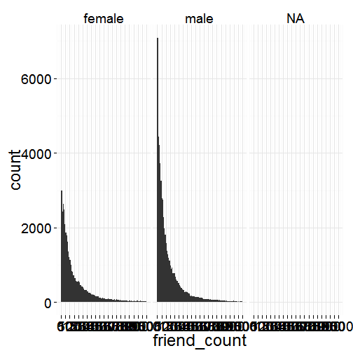 


### Omitting NA Values

```r
qplot(x = friend_count, data = subset(pf, !is.na(gender)), binwidth = 10) +
  scale_x_continuous(limits = c(0, 1000),
                     breaks = seq(0, 1000, 50))+
  facet_wrap(~gender)
```

 


```r
qplot(x = friend_count, data = na.omit(pf), binwidth = 10) +
  scale_x_continuous(limits = c(0, 1000),
                     breaks = seq(0, 1000, 50))+
  facet_wrap(~gender)
```

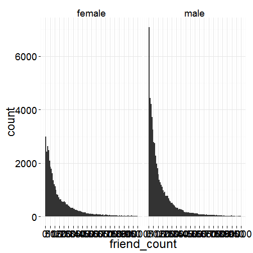 


### Statistics 'by' Gender


```r
table(pf$gender)
```

```
## 
## female   male 
##  40254  58574
```

```r
by(pf$friend_count,pf$gender,summary)
```

```
## pf$gender: female
##    Min. 1st Qu.  Median    Mean 3rd Qu.    Max. 
##       0      37      96     242     244    4923 
## -------------------------------------------------------- 
## pf$gender: male
##    Min. 1st Qu.  Median    Mean 3rd Qu.    Max. 
##       0      27      74     165     182    4917
```

#### Who on average has more friends: men or women?
Response: WOMEN

#### What's the difference between the median friend count for women and men?
Response: 77

### Tenure


```r
qplot(x = tenure, data =pf, binwidth = 30,
      color = I('black'), fill = I('#099009'))
```

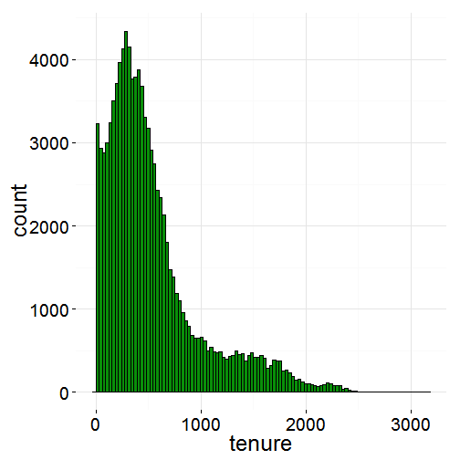 


#### How would you create a histogram of tenure by year?


```r
qplot(x = tenure/365, data =pf, binwidth = 1,
      color = I('black'), fill = I('#758381'))
```

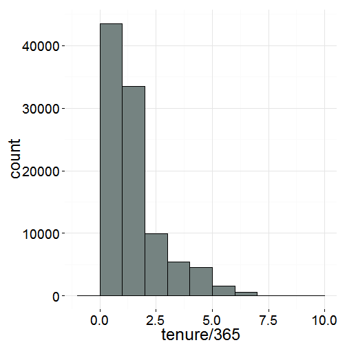 

### Labeling Plots

```r
qplot(x = tenure/365, data = pf,
      xlab = "Number of years using Facebook",
      ylab = "Nuber of users in sample",
      color = I('black'), fill = I('#F79420'))+
  scale_x_continuous(breaks = seq(1,7,1), lim = c(0,7))
```

```
## stat_bin: binwidth defaulted to range/30. Use 'binwidth = x' to adjust this.
```

 

### User Ages


```r
qplot(x = age, data = pf, binwidth = 1,
      color = I('black'), fill = I('#5760AB'))
```

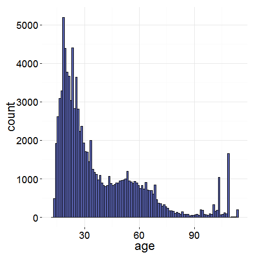 

```r
qplot(x = age, data = pf, binwidth = 1,
      fill = I('#5760AB')) +
  scale_x_continuous(breaks = seq(0,113,5))
```

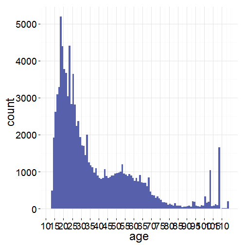 

### Transforming Data

```r
summary(pf$friend_count)
```

```
##    Min. 1st Qu.  Median    Mean 3rd Qu.    Max. 
##     0.0    31.0    82.0   196.4   206.0  4923.0
```

```r
summary(log10(pf$friend_count))
```

```
##    Min. 1st Qu.  Median    Mean 3rd Qu.    Max. 
##    -Inf       1       2    -Inf       2       4
```

```r
summary(log10(pf$friend_count+1))
```

```
##    Min. 1st Qu.  Median    Mean 3rd Qu.    Max. 
##   0.000   1.505   1.919   1.868   2.316   3.692
```

```r
summary(sqrt(pf$friend_count))
```

```
##    Min. 1st Qu.  Median    Mean 3rd Qu.    Max. 
##   0.000   5.568   9.055  11.090  14.350  70.160
```


```r
install.packages('gridExtra') 
```

```
## Error in contrib.url(repos, "source"): trying to use CRAN without setting a mirror
```

```r
library(gridExtra) 
```

```
## Loading required package: grid
```


```r
p1 <- qplot(x = friend_count, data = pf)
p2 <- qplot(x = log10(friend_count+1), data = pf)
p3 <- qplot(x = sqrt(friend_count), data = pf)
grid.arrange(p1,p2,p3,ncol = 1)
```

```
## stat_bin: binwidth defaulted to range/30. Use 'binwidth = x' to adjust this.
## stat_bin: binwidth defaulted to range/30. Use 'binwidth = x' to adjust this.
## stat_bin: binwidth defaulted to range/30. Use 'binwidth = x' to adjust this.
```

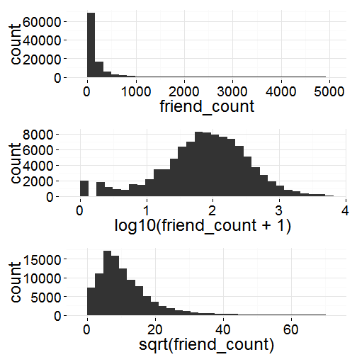 


```r
p1 <- ggplot(aes(x = friend_count), data = pf) + geom_histogram()
p2 <- p1 + scale_x_log10()
p3 <- p1 + scale_x_sqrt()
grid.arrange(p1,p2,p3,ncol = 1)
```

```
## stat_bin: binwidth defaulted to range/30. Use 'binwidth = x' to adjust this.
## stat_bin: binwidth defaulted to range/30. Use 'binwidth = x' to adjust this.
## stat_bin: binwidth defaulted to range/30. Use 'binwidth = x' to adjust this.
```

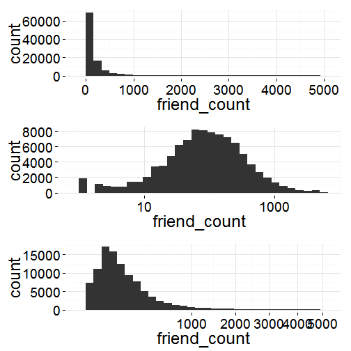 


### Add a Scaling Layer

```r
q1 <- qplot(x = log10(friend_count), data = pf)
q2 <- ggplot(aes(x = friend_count), data = pf) +
  geom_histogram()+
  scale_x_log10()
grid.arrange(q1,q2, ncol = 2)
```

```
## stat_bin: binwidth defaulted to range/30. Use 'binwidth = x' to adjust this.
## stat_bin: binwidth defaulted to range/30. Use 'binwidth = x' to adjust this.
```

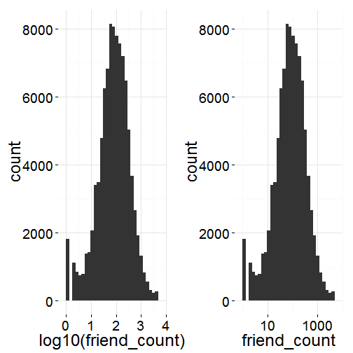 

### Frequency Polygons

```r
qplot(x = friend_count, data = subset(pf, !is.na(gender)), binwidth = 10,
      geom = "freqpoly", color = gender)+
  scale_x_continuous(limits = c(0, 1000),
                     breaks = seq(0, 1000, 50))
```

```
## Warning: Removed 2 rows containing missing values (geom_path).
```

```
## Warning: Removed 2 rows containing missing values (geom_path).
```

 


```r
qplot(x = friend_count, y = ..count../sum(..count..), 
      data = subset(pf, !is.na(gender)), binwidth = 10,
      geom = "freqpoly", color = gender) +
  scale_x_continuous(limits = c(0, 1000),
                     breaks = seq(0, 1000, 50))
```

```
## Warning: Removed 2 rows containing missing values (geom_path).
```

```
## Warning: Removed 2 rows containing missing values (geom_path).
```

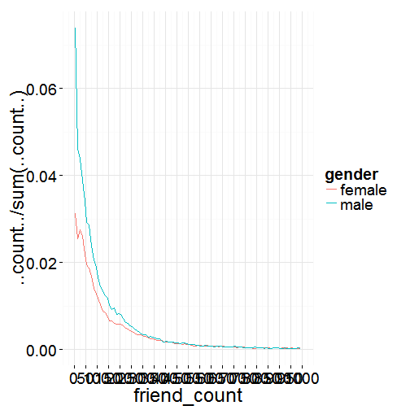 


```r
ggplot(aes(x = friend_count, y = ..count../sum(..count..)), data = subset(pf, !is.na(gender))) +
  geom_freqpoly(aes(color = gender)) + 
  scale_x_continuous(limits = c(0, 1000), breaks = seq(0, 1000, 50)) + 
  xlab('Friend Count') + 
  ylab('Percentage of users with that friend count')
```

```
## stat_bin: binwidth defaulted to range/30. Use 'binwidth = x' to adjust this.
```

```
## Warning: Removed 2 rows containing missing values (geom_path).
```

```
## Warning: Removed 2 rows containing missing values (geom_path).
```

 

### Likes on the Web

```r
by(pf$www_likes, pf$gender, sum)
```

```
## pf$gender: female
## [1] 3507665
## -------------------------------------------------------- 
## pf$gender: male
## [1] 1430175
```


```r
qplot(x = www_likes, data = subset(pf,!is.na(gender)), 
      geom = "freqpoly", color = gender) +
  scale_x_continuous() +
  scale_x_log10()
```

```
## Scale for 'x' is already present. Adding another scale for 'x', which will replace the existing scale.
## stat_bin: binwidth defaulted to range/30. Use 'binwidth = x' to adjust this.
```

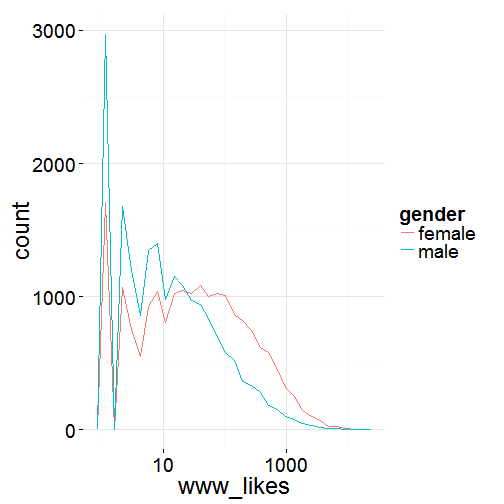 

```r
ggplot(aes(x = www_likes), data = subset(pf, !is.na(gender))) + 
  geom_freqpoly(aes(color = gender)) + 
  scale_x_log10()
```

```
## stat_bin: binwidth defaulted to range/30. Use 'binwidth = x' to adjust this.
```

 

### Box Plots


```r
qplot(x = gender, y = friend_count, data = subset(pf, !is.na(gender)), 
      geom = "boxplot")+
  scale_y_continuous(limits = c(0, 1000)) 
```

```
## Warning: Removed 2949 rows containing non-finite values (stat_boxplot).
```

 

```r
qplot(x = gender, y = friend_count, data = subset(pf, !is.na(gender)), 
      geom = "boxplot", ylim = c(0,1000))
```

```
## Warning: Removed 2949 rows containing non-finite values (stat_boxplot).
```

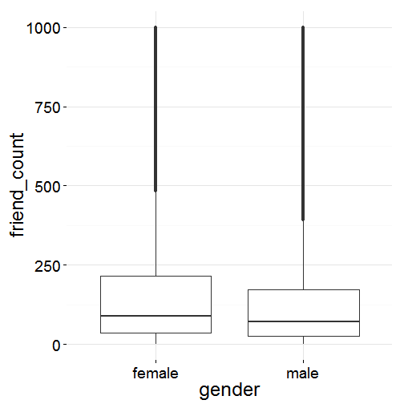 

Correct way!

```r
qplot(x = gender, y = friend_count, data = subset(pf, !is.na(gender)),
      geom = "boxplot") +
  coord_cartesian(ylim = c(0,250))
```

 

```r
by(pf$friend_count, pf$gender, summary)
```

```
## pf$gender: female
##    Min. 1st Qu.  Median    Mean 3rd Qu.    Max. 
##       0      37      96     242     244    4923 
## -------------------------------------------------------- 
## pf$gender: male
##    Min. 1st Qu.  Median    Mean 3rd Qu.    Max. 
##       0      27      74     165     182    4917
```

#### On average, who initiated more friendships in our sample: men or women?

```r
qplot(x = gender, y = friendships_initiated, data = subset(pf, !is.na(gender)), geom = 'boxplot') +
  coord_cartesian(ylim = c(0,150))
```

 

```r
by(pf$friendships_initiated, pf$gender, summary)
```

```
## pf$gender: female
##    Min. 1st Qu.  Median    Mean 3rd Qu.    Max. 
##     0.0    19.0    49.0   113.9   124.8  3654.0 
## -------------------------------------------------------- 
## pf$gender: male
##    Min. 1st Qu.  Median    Mean 3rd Qu.    Max. 
##     0.0    15.0    44.0   103.1   111.0  4144.0
```

### Getting Logical

```r
summary(pf$mobile_likes)
```

```
##    Min. 1st Qu.  Median    Mean 3rd Qu.    Max. 
##     0.0     0.0     4.0   106.1    46.0 25110.0
```

```r
summary(pf$mobile_likes > 0 )
```

```
##    Mode   FALSE    TRUE    NA's 
## logical   35056   63947       0
```

```r
mobile_check_in <- NA
pf$mobile_check_in <- ifelse(pf$mobile_likes > 0, 1, 0)
pf$mobile_check_in <- factor(pf$mobile_check_in)
summary(pf$mobile_check_in)
```

```
##     0     1 
## 35056 63947
```

```r
sum(pf$mobile_check_in == 1)/length(pf$mobile_check_in)
```

```
## [1] 0.6459097
```


Click **KnitHTML** to see all of your hard work and to have an html
page of this lesson, your answers, and your notes!
