Lesson 5
========================================================


```r
library(ggplot2)
library(ggthemes)
library(gridExtra)
```

```
## Loading required package: grid
```

```r
theme_set(theme_solarized())
pf <- read.delim('pseudo_facebook.tsv')
```

## Third Qualitative Variable

```r
ggplot(aes(x = gender, y = age),
       data = subset(pf, !is.na(gender))) + geom_boxplot()
```

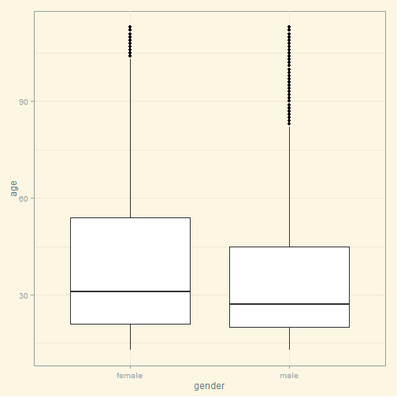 

```r
ggplot(aes(x = gender, y = age),
       data = subset(pf, !is.na(gender))) + 
  geom_boxplot() +
  stat_summary(fun.y = mean, geom = 'point', shape = 4)
```

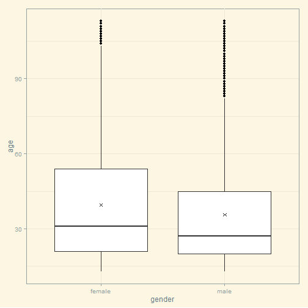 

```r
ggplot(aes(x = age, y = friend_count),
       data = subset(pf, !is.na(gender))) + 
  geom_line(aes(color = gender),stat = 'summary', fun.y = median)
```

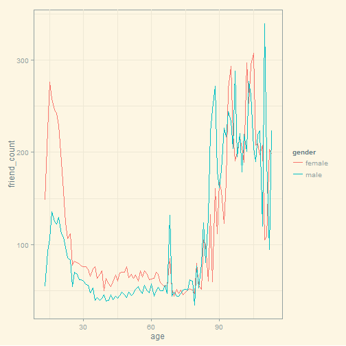 


```r
library(dplyr)
```

```
## 
## Attaching package: 'dplyr'
## 
## The following object is masked from 'package:stats':
## 
##     filter
## 
## The following objects are masked from 'package:base':
## 
##     intersect, setdiff, setequal, union
```

```r
# Write code to create a new data frame,
# called 'pf.fc_by_age_gender', that contains
# information on each age AND gender group.

# The data frame should contain the following variables:

#    mean_friend_count,
#    median_friend_count,
#    n (the number of users in each age and gender grouping)
pf.fc_by_age_gender <- pf %>%
  filter(!is.na(gender)) %>%
  group_by(age,gender) %>%
  summarise( mean_friend_count = mean(friend_count),
             median_friend_count = median(friend_count),
             n = n()) %>%
  ungroup() %>%
  arrange(age)
head(pf.fc_by_age_gender)
```

```
## Source: local data frame [6 x 5]
## 
##   age gender mean_friend_count median_friend_count    n
## 1  13 female          259.1606                 148  193
## 2  13   male          102.1340                  55  291
## 3  14 female          362.4286                 224  847
## 4  14   male          164.1456                  92 1078
## 5  15 female          538.6813                 276 1139
## 6  15   male          200.6658                 106 1478
```

### Plotting Conditional Summaries

```r
ggplot(aes(x = age, y = median_friend_count), data = pf.fc_by_age_gender) +
  geom_line(aes(color = gender))
```

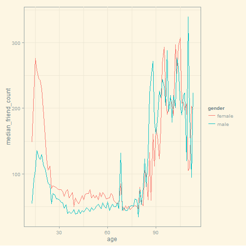 

### Reshaping Data

```r
library(reshape2)
head(pf.fc_by_age_gender)
```

```
## Source: local data frame [6 x 5]
## 
##   age gender mean_friend_count median_friend_count    n
## 1  13 female          259.1606                 148  193
## 2  13   male          102.1340                  55  291
## 3  14 female          362.4286                 224  847
## 4  14   male          164.1456                  92 1078
## 5  15 female          538.6813                 276 1139
## 6  15   male          200.6658                 106 1478
```

```r
pf.fc_by_age_gender.wide <- dcast(pf.fc_by_age_gender,
                                  age ~ gender,
                                  value.var = 'median_friend_count')
pf.fc_by_age_gender.wide$ratio <- pf.fc_by_age_gender.wide$female/pf.fc_by_age_gender.wide$male
head(pf.fc_by_age_gender.wide)
```

```
##   age female male    ratio
## 1  13    148   55 2.690909
## 2  14    224   92 2.434783
## 3  15    276  106 2.603774
## 4  16    258  136 1.897059
## 5  17    245  125 1.960000
## 6  18    243  122 1.991803
```


```r
pf.fc_by_age_gender.wide <- pf.fc_by_age_gender %>% 
  group_by(age) %>% 
  summarise(male = median_friend_count[gender == 'male'], 
                      female = median_friend_count[gender == 'female'], 
                      ratio = female / male) %>% 
  arrange(age) 

head(pf.fc_by_age_gender.wide)
```

```
## Source: local data frame [6 x 4]
## 
##   age male female    ratio
## 1  13   55    148 2.690909
## 2  14   92    224 2.434783
## 3  15  106    276 2.603774
## 4  16  136    258 1.897059
## 5  17  125    245 1.960000
## 6  18  122    243 1.991803
```

### Ratio Plot

```r
# Plot the ratio of the female to male median
# friend counts using the data frame
# pf.fc_by_age_gender.wide.

# Think about what geom you should use.
# Add a horizontal line to the plot with
# a y intercept of 1, which will be the
# base line. Look up the documentation
# for geom_hline to do that. Use the parameter
# linetype in geom_hline to make the
# line dashed.

# The linetype parameter can take the values 0-6:
# 0 = blank, 1 = solid, 2 = dashed
# 3 = dotted, 4 = dotdash, 5 = longdash
# 6 = twodash

# This assignment is not graded and
# will be marked as correct when you submit.
ggplot(aes(x = age, y = ratio), data = pf.fc_by_age_gender.wide) +
  geom_line()+
  geom_hline(yintercept = 1 ,alpha = 0.3, linetype = 2)
```

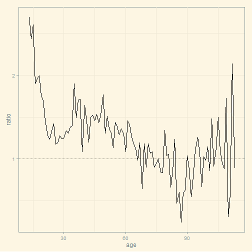 

### Third Quantitative Variable

```r
pf$year_joined <- floor(2014 - pf$tenure/365)
```

### Cut a Variable

```r
# Create a new variable in the data frame
# called year_joined.bucket by using
# the cut function on the variable year_joined.

# You need to create the following buckets for the
# new variable, year_joined.bucket

#        (2004, 2009]
#        (2009, 2011]
#        (2011, 2012]
#        (2012, 2014]


pf$year_joined.bucket <- cut(pf$year_joined, breaks = c(2004,2009,2011,2012,2014))
```

### Plotting it All Together

```r
# Create a line graph of friend_count vs. age
# so that each year_joined.bucket is a line
# tracking the median user friend_count across
# age. This means you should have four different
# lines on your plot.
ggplot(aes(x = age, y = friend_count), 
       data = subset(pf, !is.na(year_joined.bucket)))+
  geom_line(aes(color = year_joined.bucket),
            stat = 'summary', fun.y = median)
```

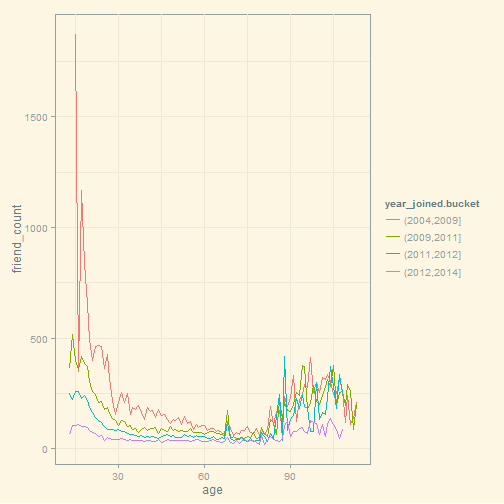 

### Plot the Grand Mean

```r
# Write code to do the following:

# (1) Add another geom_line to code below
# to plot the grand mean of the friend count vs age.

# (2) Exclude any users whose year_joined.bucket is NA.

# (3) Use a different line type for the grand mean.

# As a reminder, the parameter linetype can take the values 0-6:

# 0 = blank, 1 = solid, 2 = dashed
# 3 = dotted, 4 = dotdash, 5 = longdash
# 6 = twodash
ggplot(aes(x = age, y = friend_count), 
       data = subset(pf, !is.na(year_joined.bucket)))+
  geom_line(aes(color = year_joined.bucket),
            stat = 'summary', fun.y = mean)+
  geom_line(stat = 'summary', fun.y = mean, linetype = 2)
```

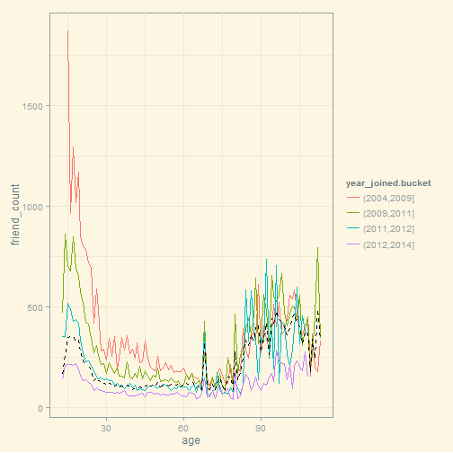 

### Friending Rate


```r
# what's median friend rate
# what's max friend rate
with(subset(pf, tenure >= 1), summary(friend_count/tenure))
```

```
##     Min.  1st Qu.   Median     Mean  3rd Qu.     Max. 
##   0.0000   0.0775   0.2205   0.6096   0.5658 417.0000
```

### Friendships Initiated

```r
# Create a line graph of mean of friendships_initiated per day (of tenure)
# vs. tenure colored by year_joined.bucket.

# You need to make use of the variables tenure,
# friendships_initiated, and year_joined.bucket.
ggplot(aes(x = tenure, y = friendships_initiated/tenure),
       data = subset(pf, tenure >= 1))+ 
  geom_line(aes(color = year_joined.bucket),
            stat = 'summary', fun.y = mean)
```

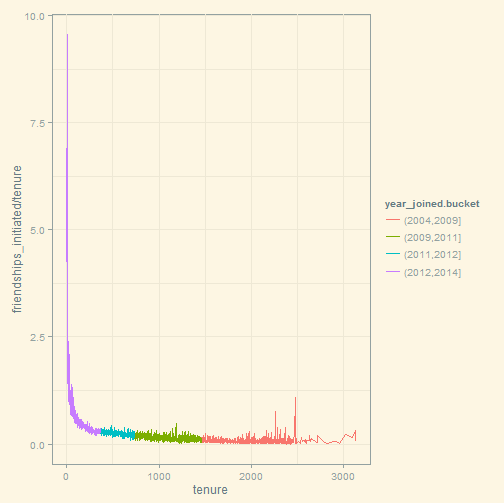 

### Bias-Variance Tradeoff Revisited
Notes:

```r
p1 <- ggplot(aes(x = tenure, y = friendships_initiated/tenure),
       data = subset(pf, tenure >= 1))+ 
  geom_line(aes(color = year_joined.bucket),
            stat = 'summary', fun.y = mean)

p2 <- ggplot(aes(x = 7 * round(tenure / 7), y = friendships_initiated / tenure),
       data = subset(pf, tenure > 0)) +
  geom_line(aes(color = year_joined.bucket),
            stat = "summary",
            fun.y = mean)

p3 <- ggplot(aes(x = 30 * round(tenure / 30), y = friendships_initiated / tenure),
       data = subset(pf, tenure > 0)) +
  geom_line(aes(color = year_joined.bucket),
            stat = "summary",
            fun.y = mean)

p4 <- ggplot(aes(x = 90 * round(tenure / 90), y = friendships_initiated / tenure),
       data = subset(pf, tenure > 0)) +
  geom_line(aes(color = year_joined.bucket),
            stat = "summary",
            fun.y = mean)
grid.arrange(p1,p2,p3,p4, ncol = 1)
```

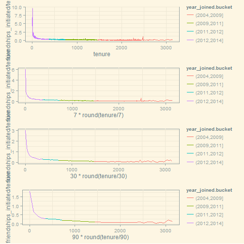 


```
## geom_smooth: method="auto" and size of largest group is >=1000, so using gam with formula: y ~ s(x, bs = "cs"). Use 'method = x' to change the smoothing method.
```

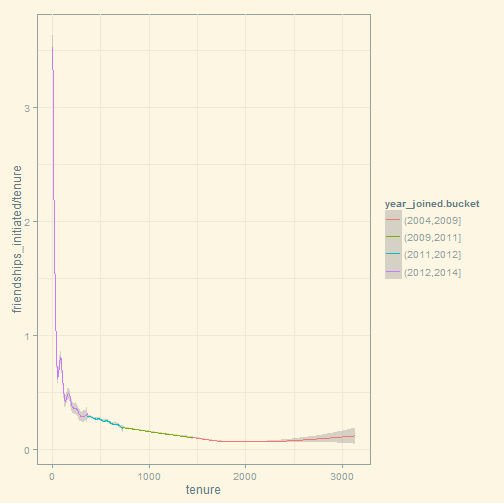 

### Histograms Revisited

```r
yo <- read.csv('yogurt.csv')
str(yo)
```

```
## 'data.frame':	2380 obs. of  9 variables:
##  $ obs        : int  1 2 3 4 5 6 7 8 9 10 ...
##  $ id         : int  2100081 2100081 2100081 2100081 2100081 2100081 2100081 2100081 2100081 2100081 ...
##  $ time       : int  9678 9697 9825 9999 10015 10029 10036 10042 10083 10091 ...
##  $ strawberry : int  0 0 0 0 1 1 0 0 0 0 ...
##  $ blueberry  : int  0 0 0 0 0 0 0 0 0 0 ...
##  $ pina.colada: int  0 0 0 0 1 2 0 0 0 0 ...
##  $ plain      : int  0 0 0 0 0 0 0 0 0 0 ...
##  $ mixed.berry: int  1 1 1 1 1 1 1 1 1 1 ...
##  $ price      : num  59 59 65 65 49 ...
```

```r
yo$id <- as.factor(yo$id)
ggplot(aes(x = price), data =yo) +
  geom_histogram()
```

```
## stat_bin: binwidth defaulted to range/30. Use 'binwidth = x' to adjust this.
```

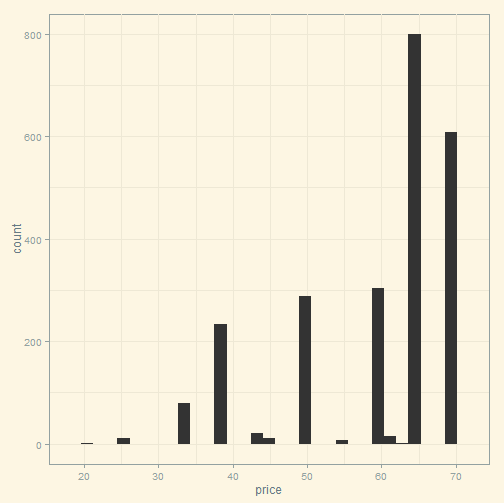 


### Number of Purchases

```r
yo <- transform(yo, all.purchase = strawberry + blueberry + pina.colada + plain + mixed.berry)
```

### Prices over Time

```r
ggplot(aes(x = all.purchase, fill = 'orange'), data = yo) +
  geom_histogram(binwidth = 1)
```

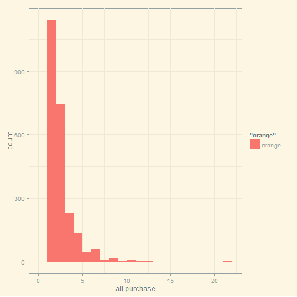 

```r
ggplot(aes(x = time, y = price), data = yo) +
  geom_jitter(alpha = 1/10)
```

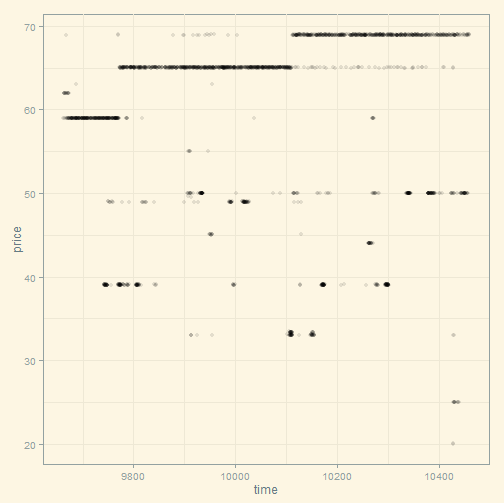 

### Looking at Samples of Households


```r
set.seed(4230)
sample.ids <- sample(levels(yo$id),16)

ggplot(aes(x = time, y = price),
       data = subset(yo, id %in% sample.ids))+
  facet_wrap(~ id)+
  geom_line()+
  geom_point(aes(size = all.purchase), pch = 1)
```

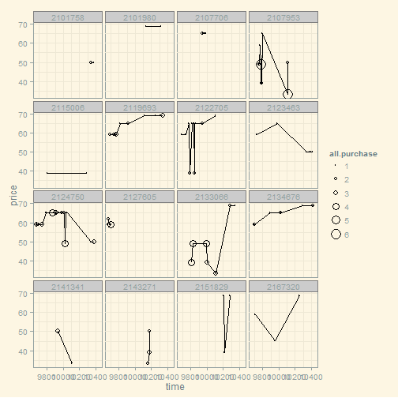 

### Scatterplot Matrix

```r
#install.packages('GGally')
library(GGally)
set.seed(1836)
pf_subset <- pf[, c(2:15)]
names(pf_subset)
```

```
##  [1] "age"                   "dob_day"              
##  [3] "dob_year"              "dob_month"            
##  [5] "gender"                "tenure"               
##  [7] "friend_count"          "friendships_initiated"
##  [9] "likes"                 "likes_received"       
## [11] "mobile_likes"          "mobile_likes_received"
## [13] "www_likes"             "www_likes_received"
```

```r
ggpairs(pf_subset[sample.int(nrow(pf_subset),1000),])
```

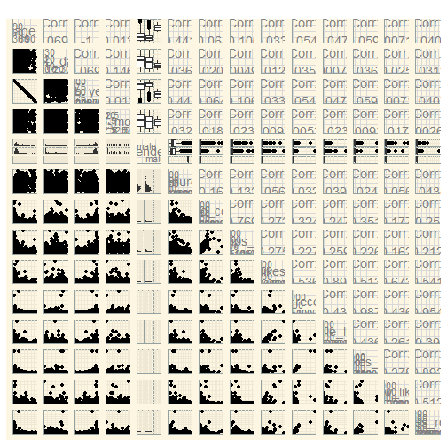 

### Heat Maps

```r
nci <- read.table("nci.tsv")
colnames(nci) <- c(1:64)
```


```r
nci.long.samp <- melt(as.matrix(nci[1:200,]))
names(nci.long.samp) <- c("gene", "case", "value")
head(nci.long.samp)
```

```
##   gene case  value
## 1    1    1  0.300
## 2    2    1  1.180
## 3    3    1  0.550
## 4    4    1  1.140
## 5    5    1 -0.265
## 6    6    1 -0.070
```

```r
ggplot(aes(y = gene, x = case, fill = value),
  data = nci.long.samp) +
  geom_tile() +
  scale_fill_gradientn(colours = colorRampPalette(c("blue", "red"))(100))
```

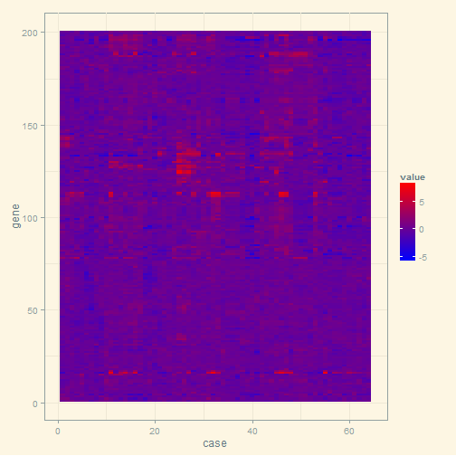 


Click **KnitHTML** to see all of your hard work and to have an html
page of this lesson, your answers, and your notes!

