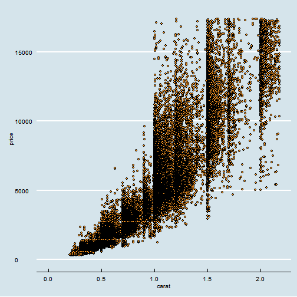
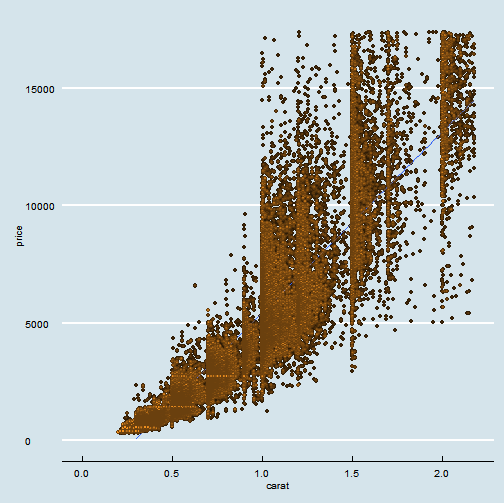
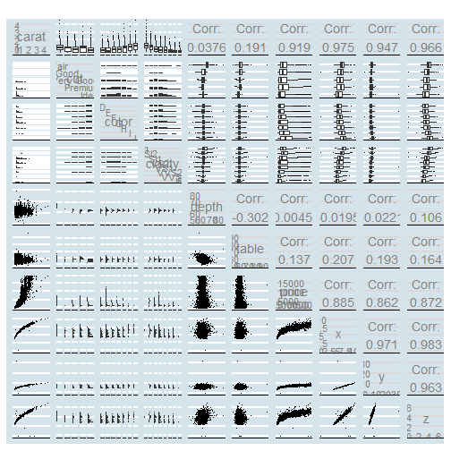
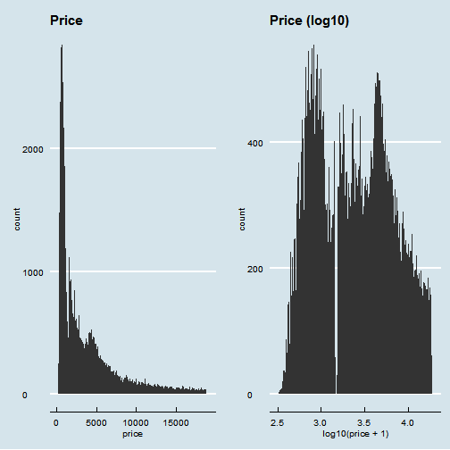
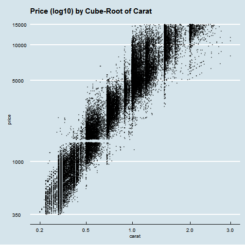
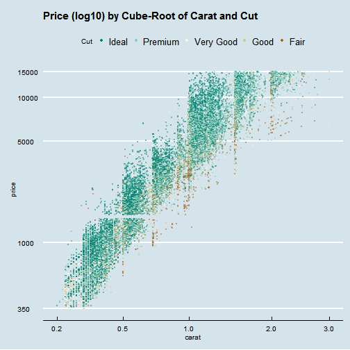
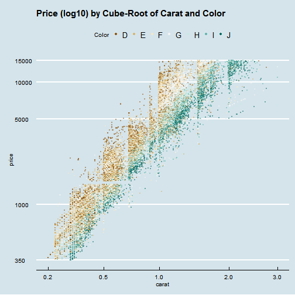

Lesson 6
========================================================

### Scatterplot Review


```r
library(ggplot2)
library(ggthemes)
theme_set(theme_economist())
```

```
## Warning: New theme missing the following elements: legend.box,
## panel.margin.x, panel.margin.y
```

```r
qplot(data = diamonds, x = carat, y = price,
      xlim = c(0, quantile(diamonds$carat, 0.99)),
      ylim = c(0, quantile(diamonds$price, 0.99)))+
  geom_point(fill = I('#F79420'), color = I('black'), shape = 21)
```

```
## Warning: Removed 926 rows containing missing values (geom_point).
```

```
## Warning: Removed 926 rows containing missing values (geom_point).
```

 

### Price and Carat Relationship
Non linear relationship and the variance increases when carat increase.

```r
qplot(data = diamonds, x = carat, y = price,
      xlim = c(0, quantile(diamonds$carat, 0.99)),
      ylim = c(0, quantile(diamonds$price, 0.99)))+
  stat_smooth(method = 'lm') +
  geom_point(fill = I('#F79420'), color = I('black'), shape = 21, alpha = 1/4)
```

```
## Warning: Removed 926 rows containing missing values (stat_smooth).
```

```
## Warning: Removed 926 rows containing missing values (geom_point).
```

```
## Warning: Removed 4 rows containing missing values (geom_path).
```

```
## Warning: Removed 926 rows containing missing values (geom_point).
```

 


### ggpairs Function

```r
# install these if necessary
# install.packages('memisc')
# install.packages('lattice')
# install.packages('MASS')
# install.packages('car')
# install.packages('reshape')
# install.packages('plyr')

# load the ggplot graphics package and the others
library(GGally)
library(scales)
library(memisc)
```

```
## Loading required package: lattice
## Loading required package: MASS
## 
## Attaching package: 'memisc'
## 
## The following object is masked from 'package:scales':
## 
##     percent
## 
## The following objects are masked from 'package:stats':
## 
##     contr.sum, contr.treatment, contrasts
## 
## The following object is masked from 'package:base':
## 
##     as.array
```

```r
# sample 10,000 diamonds from the data set
set.seed(20022012)
diamond_samp <- diamonds[sample(1:length(diamonds$price), 10000), ]
ggpairs(diamond_samp, params = c(shape = I('.'), outlier.shape = I('.')))
```

 

What are some things you notice in the ggpairs output?
Response:
clarity and color are related to price.
carat and x,y,z are correlated with price.

### The Demand of Diamonds

```r
# Create two histograms of the price variable
# and place them side by side on one output image.

# We¡¯ve put some code below to get you started.

# The first plot should be a histogram of price
# and the second plot should transform
# the price variable using log10.

# Set appropriate bin widths for each plot.
# ggtitle() will add a title to each histogram.
library(gridExtra)
```

```
## Loading required package: grid
```

```r
plot1 <- qplot(price, data = diamonds, binwidth = 100) + 
  ggtitle('Price')
plot2 <- qplot(log10(price+1), data = diamonds, binwidth = 0.01) +
  ggtitle('Price (log10)')
grid.arrange(plot1, plot2, ncol = 2)
```

```
## Warning: position_stack requires constant width: output may be incorrect
```

 


### Create a new function to transform the carat variable


```r
cuberoot_trans = function(){
  trans_new('cuberoot',
            transform = function(x) {x^(1/3)},
            inverse = function(x){ x^3})
  }
```

#### Use the cuberoot_trans function

```r
# Add a layer to adjust the features of the
# scatterplot. Set the transparency to one half,
# the size to three-fourths, and jitter the points.
ggplot(aes(carat, price), data = diamonds) + 
  geom_point(alpha = 1/2, size = 3/4, position = 'jitter') + 
  scale_x_continuous(trans = cuberoot_trans(), limits = c(0.2, 3),
                     breaks = c(0.2, 0.5, 1, 2, 3)) + 
  scale_y_continuous(trans = log10_trans(), limits = c(350, 15000),
                     breaks = c(350, 1000, 5000, 10000, 15000)) +
  ggtitle('Price (log10) by Cube-Root of Carat')
```

```
## Warning: Removed 1691 rows containing missing values (geom_point).
```

 

### Price vs. Carat and Clarity
Alter the code below.

```r
# install and load the RColorBrewer package
#install.packages('RColorBrewer')
library(RColorBrewer)

ggplot(aes(x = carat, y = price, color = clarity), data = diamonds) + 
  geom_point(alpha = 0.5, size = 1, position = 'jitter') +
  scale_color_brewer(type = 'div',
    guide = guide_legend(title = 'Clarity', reverse = T,
    override.aes = list(alpha = 1, size = 2))) +  
  scale_x_continuous(trans = cuberoot_trans(), limits = c(0.2, 3),
    breaks = c(0.2, 0.5, 1, 2, 3)) + 
  scale_y_continuous(trans = log10_trans(), limits = c(350, 15000),
    breaks = c(350, 1000, 5000, 10000, 15000)) +
  ggtitle('Price (log10) by Cube-Root of Carat and Clarity')
```

```
## Warning: Removed 1693 rows containing missing values (geom_point).
```

 

### Price vs. Carat and Cut
Alter the code below.

```r
ggplot(aes(x = carat, y = price, color = cut), data = diamonds) + 
  geom_point(alpha = 0.5, size = 1, position = 'jitter') +
  scale_color_brewer(type = 'div',
                     guide = guide_legend(title = 'Cut', reverse = T,
                                          override.aes = list(alpha = 1, size = 2))) +  
  scale_x_continuous(trans = cuberoot_trans(), limits = c(0.2, 3),
                     breaks = c(0.2, 0.5, 1, 2, 3)) + 
  scale_y_continuous(trans = log10_trans(), limits = c(350, 15000),
                     breaks = c(350, 1000, 5000, 10000, 15000)) +
  ggtitle('Price (log10) by Cube-Root of Carat and Cut')
```

```
## Warning: Removed 1696 rows containing missing values (geom_point).
```

 

### Cut and Price

```r
table(diamonds$cut)
```

```
## 
##      Fair      Good Very Good   Premium     Ideal 
##      1610      4906     12082     13791     21551
```

### Price vs. Carat and Color
Alter the code below.

```r
ggplot(aes(x = carat, y = price, color = color), data = diamonds) + 
  geom_point(alpha = 0.5, size = 1, position = 'jitter') +
  scale_color_brewer(type = 'div',
                     guide = guide_legend(title = 'Color', reverse = F,
                                          override.aes = list(alpha = 1, size = 2))) +  
  scale_x_continuous(trans = cuberoot_trans(), limits = c(0.2, 3),
                     breaks = c(0.2, 0.5, 1, 2, 3)) + 
  scale_y_continuous(trans = log10_trans(), limits = c(350, 15000),
                     breaks = c(350, 1000, 5000, 10000, 15000)) +
  ggtitle('Price (log10) by Cube-Root of Carat and Color')
```

```
## Warning: Removed 1688 rows containing missing values (geom_point).
```

 

### Building the Linear Model

```r
m1 <- lm(I(log(price)) ~ I(carat^(1/3)), data = diamonds)
m2 <- update(m1, ~ . + carat)
m3 <- update(m2, ~ . + cut)
m4 <- update(m3, ~ . + color)
m5 <- update(m4, ~ . + clarity)
mtable(m1, m2, m3, m4, m5)
```

```
## 
## Calls:
## m1: lm(formula = I(log(price)) ~ I(carat^(1/3)), data = diamonds)
## m2: lm(formula = I(log(price)) ~ I(carat^(1/3)) + carat, data = diamonds)
## m3: lm(formula = I(log(price)) ~ I(carat^(1/3)) + carat + cut, data = diamonds)
## m4: lm(formula = I(log(price)) ~ I(carat^(1/3)) + carat + cut + color, 
##     data = diamonds)
## m5: lm(formula = I(log(price)) ~ I(carat^(1/3)) + carat + cut + color + 
##     clarity, data = diamonds)
## 
## ======================================================================
##                     m1         m2         m3         m4         m5    
## ----------------------------------------------------------------------
## (Intercept)      2.821***   1.039***   0.874***   0.932***   0.415*** 
##                 (0.006)    (0.019)    (0.019)    (0.017)    (0.010)   
## I(carat^(1/3))   5.558***   8.568***   8.703***   8.438***   9.144*** 
##                 (0.007)    (0.032)    (0.031)    (0.028)    (0.016)   
## carat                      -1.137***  -1.163***  -0.992***  -1.093*** 
##                            (0.012)    (0.011)    (0.010)    (0.006)   
## cut: .L                                0.224***   0.224***   0.120*** 
##                                       (0.004)    (0.004)    (0.002)   
## cut: .Q                               -0.062***  -0.062***  -0.031*** 
##                                       (0.004)    (0.003)    (0.002)   
## cut: .C                                0.051***   0.052***   0.014*** 
##                                       (0.003)    (0.003)    (0.002)   
## cut: ^4                                0.018***   0.018***  -0.002    
##                                       (0.003)    (0.002)    (0.001)   
## color: .L                                        -0.373***  -0.441*** 
##                                                  (0.003)    (0.002)   
## color: .Q                                        -0.129***  -0.093*** 
##                                                  (0.003)    (0.002)   
## color: .C                                         0.001     -0.013*** 
##                                                  (0.003)    (0.002)   
## color: ^4                                         0.029***   0.012*** 
##                                                  (0.003)    (0.002)   
## color: ^5                                        -0.016***  -0.003*   
##                                                  (0.003)    (0.001)   
## color: ^6                                        -0.023***   0.001    
##                                                  (0.002)    (0.001)   
## clarity: .L                                                  0.907*** 
##                                                             (0.003)   
## clarity: .Q                                                 -0.240*** 
##                                                             (0.003)   
## clarity: .C                                                  0.131*** 
##                                                             (0.003)   
## clarity: ^4                                                 -0.063*** 
##                                                             (0.002)   
## clarity: ^5                                                  0.026*** 
##                                                             (0.002)   
## clarity: ^6                                                 -0.002    
##                                                             (0.002)   
## clarity: ^7                                                  0.032*** 
##                                                             (0.001)   
## ----------------------------------------------------------------------
## R-squared            0.924      0.935      0.939     0.951       0.984
## adj. R-squared       0.924      0.935      0.939     0.951       0.984
## sigma                0.280      0.259      0.250     0.224       0.129
## F               652012.063 387489.366 138654.523 87959.467  173791.084
## p                    0.000      0.000      0.000     0.000       0.000
## Log-likelihood   -7962.499  -3631.319  -1837.416  4235.240   34091.272
## Deviance          4242.831   3613.360   3380.837  2699.212     892.214
## AIC              15930.999   7270.637   3690.832 -8442.481  -68140.544
## BIC              15957.685   7306.220   3761.997 -8317.942  -67953.736
## N                53940      53940      53940     53940       53940    
## ======================================================================
```

Notice how adding cut to our model does not help explain much of the variance
in the price of diamonds. This fits with out exploration earlier.

### A Bigger, Better Data Set

```r
library('bitops')
load('BigDiamonds.Rda')
```

The code used to obtain the data is available here:
https://github.com/solomonm/diamonds-data

## Building a Model Using the Big Diamonds Data Set


```r
diamondsbig$logprice <- log(diamondsbig$price)
m1 <- lm(logprice ~ I(carat^(1/3)),
         data = diamondsbig[diamondsbig$price < 10000 &
                              diamondsbig$cert == "GIA",])
m2 <- update(m1, ~. + carat)
m3 <- update(m2, ~. + cut)
m4 <- update(m3, ~. + color)
m5 <- update(m4, ~. + clarity)
mtable(m1,m2,m3,m4,m5)
```

```
## 
## Calls:
## m1: lm(formula = logprice ~ I(carat^(1/3)), data = diamondsbig[diamondsbig$price < 
##     10000 & diamondsbig$cert == "GIA", ])
## m2: lm(formula = logprice ~ I(carat^(1/3)) + carat, data = diamondsbig[diamondsbig$price < 
##     10000 & diamondsbig$cert == "GIA", ])
## m3: lm(formula = logprice ~ I(carat^(1/3)) + carat + cut, data = diamondsbig[diamondsbig$price < 
##     10000 & diamondsbig$cert == "GIA", ])
## m4: lm(formula = logprice ~ I(carat^(1/3)) + carat + cut + color, 
##     data = diamondsbig[diamondsbig$price < 10000 & diamondsbig$cert == 
##         "GIA", ])
## m5: lm(formula = logprice ~ I(carat^(1/3)) + carat + cut + color + 
##     clarity, data = diamondsbig[diamondsbig$price < 10000 & diamondsbig$cert == 
##     "GIA", ])
## 
## ===========================================================================
##                     m1          m2          m3          m4          m5     
## ---------------------------------------------------------------------------
## (Intercept)       2.671***    1.333***    0.949***    0.529***   -0.464*** 
##                  (0.003)     (0.012)     (0.012)     (0.010)     (0.009)   
## I(carat^(1/3))    5.839***    8.243***    8.633***    8.110***    8.320*** 
##                  (0.004)     (0.022)     (0.021)     (0.017)     (0.012)   
## carat                        -1.061***   -1.223***   -0.782***   -0.763*** 
##                              (0.009)     (0.009)     (0.007)     (0.005)   
## cut: V.Good                               0.120***    0.090***    0.071*** 
##                                          (0.002)     (0.001)     (0.001)   
## cut: Ideal                                0.211***    0.181***    0.131*** 
##                                          (0.002)     (0.001)     (0.001)   
## color: K/L                                            0.123***    0.117*** 
##                                                      (0.004)     (0.003)   
## color: J/L                                            0.312***    0.318*** 
##                                                      (0.003)     (0.002)   
## color: I/L                                            0.451***    0.469*** 
##                                                      (0.003)     (0.002)   
## color: H/L                                            0.569***    0.602*** 
##                                                      (0.003)     (0.002)   
## color: G/L                                            0.633***    0.665*** 
##                                                      (0.003)     (0.002)   
## color: F/L                                            0.687***    0.723*** 
##                                                      (0.003)     (0.002)   
## color: E/L                                            0.729***    0.756*** 
##                                                      (0.003)     (0.002)   
## color: D/L                                            0.812***    0.827*** 
##                                                      (0.003)     (0.002)   
## clarity: I1                                                       0.301*** 
##                                                                  (0.006)   
## clarity: SI2                                                      0.607*** 
##                                                                  (0.006)   
## clarity: SI1                                                      0.727*** 
##                                                                  (0.006)   
## clarity: VS2                                                      0.836*** 
##                                                                  (0.006)   
## clarity: VS1                                                      0.891*** 
##                                                                  (0.006)   
## clarity: VVS2                                                     0.935*** 
##                                                                  (0.006)   
## clarity: VVS1                                                     0.995*** 
##                                                                  (0.006)   
## clarity: IF                                                       1.052*** 
##                                                                  (0.006)   
## ---------------------------------------------------------------------------
## R-squared             0.888       0.892      0.899       0.937        0.969
## adj. R-squared        0.888       0.892      0.899       0.937        0.969
## sigma                 0.289       0.284      0.275       0.216        0.154
## F               2700903.714 1406538.330 754405.425  423311.488   521161.443
## p                     0.000       0.000      0.000       0.000        0.000
## Log-likelihood   -60137.791  -53996.269 -43339.818   37830.414   154124.270
## Deviance          28298.689   27291.534  25628.285   15874.910     7992.720
## AIC              120281.582  108000.539  86691.636  -75632.827  -308204.540
## BIC              120313.783  108043.473  86756.037  -75482.557  -307968.400
## N                338946      338946     338946      338946       338946    
## ===========================================================================
```

## Predictions
Example Diamond from BlueNile:
Round 1.00 Very Good I VS1 $5,601

```r
#Be sure you have loaded the library memisc and have m5 saved as an object in your workspace.
thisDiamond = data.frame(carat = 1.00, cut = "V.Good",
                         color = "I", clarity="VS1")
modelEstimate = predict(m5, newdata = thisDiamond,
                        interval="prediction", level = .95)
```

Evaluate how well the model predicts the BlueNile diamond's price. Think about the fitted point estimate as well as the 95% CI.

Click **KnitHTML** to see all of your hard work and to have an html
page of this lesson, your answers, and your notes!

